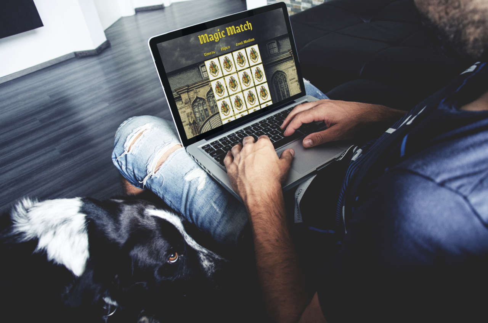
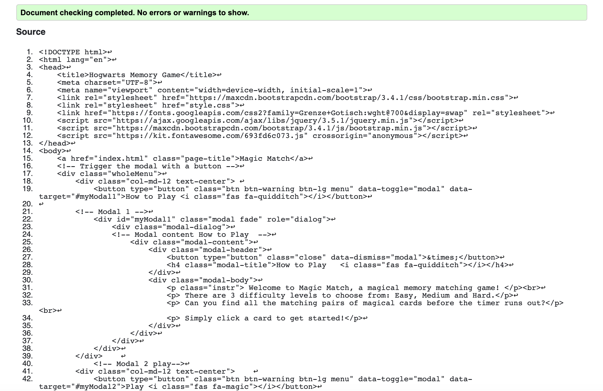
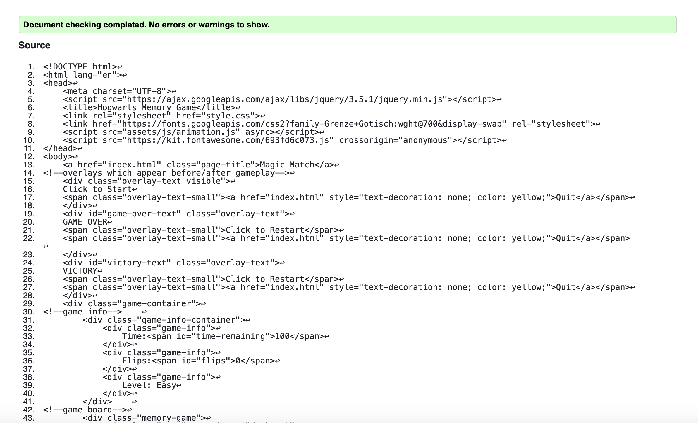

<h1 align="center">Milestone Project 2</h1>

[View the live project here.](https://mcranter.github.io/Milestone2/index.html)

Welcome to Magical Match, a single player card game testing memory and speed.

## User Experience (UX)

-   ### User stories

    -   #### Casual Player Goals

        1. As a casual gamer, my priority is a fun gameplay experience.
        2. As a casual gamer I want the gameplay mechanism to be immediately obvious.
        3. If a level is too hard, I want the option to quit.
        4. If a level is too easy, I want the option to select a more difficult one.

        #### Experienced Player Goals

        1. As an experienced gamer I want to be able to scale up the difficulty level if I want.
        2. As an experienced gamer I want to be challenged.
        3. As an experienced gamer I want game that encourages repeat plays.

    -   #### Game Designer's Goals
        1. To engage and entertain both casual and experienced game players.
        2. To create an enjoyable, bug-free gameplay experience.
        3. To encourage multiple replays.

    -   ### Design
    -   #### Colour Scheme
        -   The main colours used are Yellow (#ebd512) and dark-orange(#f0Ad4e) for titles and modal backgrounds and Black and White for fonts.
    -   #### Typography
        -   The Grenze Gotisch font is the main font used in the game. This font was chosen for its evocative qualities, conjuring a gothic yet 'magical' sensibility that reflects the game's theme.
        -   Grenze Gotisch is a Google Font.
    -   #### Imagery
        -   The castle background is intended to compliment the 'Grenze Gotisch' font by reflecting the magical, gothic theme.

*   ### Wireframes

    -   Home Page Wireframe (Desktop/Mobile) - [View](https://bit.ly/34GYUjW)
    -   Game board Wireframes (Desktop/Mobile) - [View](https://bit.ly/2Fl7tsa), [View](https://bit.ly/33Q3hKn)
    -   Victory Modal Wireframe - [View](https://bit.ly/3nH8P1W)

## Features

### Existing Features

-   Sounds: This game uses sounds to alert the player to various events (like the existence of a match, victory or the end of the game.) Using sounds during these events also helps create [positive reinforcement ](https://game-design-snacks.fandom.com/wiki/Positive_Reinforcement_Through_Audio_Visual_Cues) which encourages repeat game playing.

-   Interactive play mechanism playable on all devices.

### Future Features

-   Scoreboard: A scoreboard would add to the competitive element of the game and increase replay value.

-   Card Match counter: Not included initially due to concerns about the display looking crowded (with flip, time, and level already displayed).

## Technologies Used

### Languages Used

-   [HTML5](https://en.wikipedia.org/wiki/HTML5)
-   [CSS3](https://en.wikipedia.org/wiki/Cascading_Style_Sheets)
-   [Javascript](https://en.wikipedia.org/wiki/javascript)

### Frameworks, Libraries & Programs Used

1. [Bootstrap 4.4.1:](https://getbootstrap.com/docs/4.4/getting-started/introduction/)
    - Bootstrap was used to assist with the layout and styling of the landing menu.
1. [Hover.css:](https://ianlunn.github.io/Hover/)
    - Hover.css was used to all buttons to add the float transition while being hovered over.
1. [Google Fonts:](https://fonts.google.com/)
    - Google fonts were used to import the 'Grenze' font into the style.css file which is used on pages throughout the project.
1. [Font Awesome:](https://fontawesome.com/)
    - Font Awesome was used on several pages throughout the website to add icons for aesthetic and UX purposes.
1. [jQuery:](https://jquery.com/)
    - jQuery was used to create elements of the game's functionality.
1. [Git](https://git-scm.com/)
    - Git was used for version control by utilising the Gitpod terminal to commit to Git and Push to GitHub.
1. [GitHub:](https://github.com/)
    - GitHub is used to store the projects code after being pushed from Git.
1. [Zapsplat:](https://www.zapsplat.com/)
    - Zapsplat was used to source the sounds used in this game.
1. [Pixabay:](https://www.pixabay.com/)
    - Pixabay was used to source the background image for this game.
1. [RW Designer](http://www.rw-designer.com/)
    - Cursor icon sourced from site user LightningBoy2527.
1. [Figma:](https://figma.com/)
    - Figma was used to create the [wireframes](https://bit.ly/2Z71nme) during the design process.
1. [Pinterest:](https://pinterest.com/)
    - Pinterest was used to source the fan-made clip art images used on the card fronts.
1. [Magic Mockups:](https://magicmockups.com/)
    - Magic Mockups was used to generate images used through this file.    

## Testing

The W3C Markup Validator and W3C CSS Validator Services were used to validate every page of the project to ensure there were no syntax errors in the project.

-   [W3C Markup Validator](https://jigsaw.w3.org/css-validator/#validate_by_input) :
- [Results]
1. Index 
2. Easy 
3. ()

-   [W3C CSS Validator](https://jigsaw.w3.org/css-validator/#validate_by_input) - [Results](https://github.com/)

### Testing User Stories from User Experience (UX) Section

-   #### Casual Player Goals

    1. "As a casual gamer, my priority is a fun gameplay experience.".

        1. The Easy level is designed for entry-level play: the number of cards (12) is "manageable" and there is an extended time counter (100 seconds). This means the player can focus on the game task without worrying about time constraints.

    2. "As a casual gamer I want the gameplay mechanism to be immediately obvious."

        1. The layout of the game play page(s) follows a standard, familiar format - once the player clicks a card, they are shown the reverse side and the aim of the game becomes obvious: click cards over and find all the matches.

        2. The landing (index.html) page contains a clearly labelled 'How to play' button/modal which informs the player of the gameplay mechanics.

    3. "As a new fan I want to hear/see the band's work."

        1. The About Us page enables the visitor to see the band's latest video, hear the band's music via a playlist and view the band's entire discography.
        2. The Gallery page contains images of the band's past performances.

-   #### Experienced Player Goals

    1. "As a wedding planner, I want to look into booking this band".

        1. Contact details are  clearly signposted on the contact page making it easy to find and contact the band.
        2. Wedding reviews promoted on the home page add an inducement to book the band.

    2. "As a record company exec I want to gauge this band's talent."

        1. Samples of the band's music - video and an audio playlist - are embedded on the About Us page to make it easy to experience the band's work with minimal effort.
        2. The Gallery page contains thrilling images of the band live which serve as both endorsement and advertisement to any potential music industry professionals.

-   #### Game Designer's Goals

    1. "As an existing fan, I want to keep up with the band's activities."

        1. Links to the band's social media pages, where updates can be found is displayed on the footer of each page. The About Us page contains links to the individual band member Twitter accounts under their respective profiles. In addition, a Newsletter sign up form appears on the bottom of each page.

    1. "As an existing fan, I want to view the band's gallery."

        1. The Gallery, clearly signposted in the header, contains numerous images and is engaging on both desktop/tablet and mobile.

    1.  "As an existing fan, I want to buy some merchandise."

        1. The Home page contains a selection of merchandise, clearly labeled and laid out.

    1.   "As an existing fan, I want to sign up to the Newsletter so that I am emailed any major updates and/or changes to the band."

        1. Each page contains a minimalist, but clearly marked Newsletter form just above the Footer.

-       #### Band/ Site Owner Goals

    3. "As the owner of the site and member of the band, I wish to increase our revenue."

        1. As the this is a priority: both merchandise and professional services (in the form of wedding performances) are advertised on the Home page by way of the 'Review' section.
        2. Merchandise is offered in the form of various items after the 'Review' section.

-   #### Frequent User Goals

    1. "As a Frequent Visitor, I want to check to see if there are any updates to the band."

        1. The inclusion of clickable social media icons in the Footer makes keeping up-to-date in real-time possible.
        2. The inclusion of the respective band member's Twitter handles on the About Us page facilitates communication of updates.
        3. The Newsletter sign up form offers the chance to keep informed.

### Further Testing

-   The Website was tested on Google Chrome, Internet Explorer, Microsoft Edge and Safari browsers.
-   The website was viewed on a variety of devices such as Desktop, Laptop, iPhone5/6/7/8,iPhoneX, iPad, Moto, Galaxy 5.
-   A large amount of testing was done to ensure that all pages were linking correctly.
-   Friends and family members were asked to review the site and documentation to point out any bugs and/or user experience issues.

### Known Bugs

-   
-   

## Deployment

The site has been deployed to github and is accessible on [gitpages](https://mcranter.github.io/Milestone2/index.html)

## Credits

### Code

-   The Newsletter sign-up form code appearing on the bottom of each page was written with the help of [this](https://www.w3schools.com/howto/tryit.asp?filename=tryhow_css_inline_form) W3 Schools guide.

-   [Bootstrap4](https://getbootstrap.com/docs/4.4/getting-started/introduction/): Bootstrap Library used throughout the project mainly to make site responsive using the Bootstrap Grid System.

### Content

-   All content was written by the developer unless otherwise stated.

### Media

-   All Images were created by the developer unless otherwise stated.

### Acknowledgements

-   Thanks to my Mentor Precious Ijege for continuous helpful feedback.

-   Thanks to Tutor support at Code Institute for their support.

-   [W3 Schools](https://www.w3schools.com/)

-   [StackOverflow](http://stackoverflow.com/)
